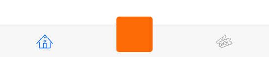

[![Swift Version][swift-image]][swift-url]
[](http://cocoadocs.org/docsets/MiniTabBar)

[](https://twitter.com/dylan36032)

# MiniTabBar
A clean simple alternative to the UITabBar. Only shows the title when being tapped on. Gives the app a way cleaner look :)


## Requirements
- iOS 8.0+
- Xcode 8

## Installation

####CocoaPods:
You can use [CocoaPods](http://cocoapods.org/) to install `MiniTabBar` by adding it to your `Podfile`:

```ruby
pod 'MiniTabBar'
```	
#### Manually
Drag and drop `MiniTabBar.swift` and `MiniTabBarItemView.swift` into your project.

## Usage

```swift
// First create some tab bar items:
// Icons should be a template image with the size 26 x 20 dp
var items = [MiniTabBarItem]()
items.append(MiniTabBarItem(title: "Tab Name", icon: <UIImage>))
//...

// Create a MiniTabBar instance and add it as a regular subview:
let tabBar = MiniTabBar(items: items)
tabBar.delegate = self
tabBar.frame = CGRect(x: 0, y: self.view.frame.height - 44, width: self.view.frame.width, height: 44)
self.view.addSubview(tabBar)

// Delegate protocol:
func tabSelected(_ index: Int) {
	print("Selected tab: ", index)
}
```

## Costumization

Here are some ways to customize the look of the MiniTabBar:

```swift
// Change the tint colour of an item (title & icon):
tabBar.tintColor = UIColor.red

// Change the font of the title label:
tabBar.font = UIFont.systemFont(ofSize: 10)

// Select an item programmatically: 
tabBar.selectItem(2, animated: false)

// Change the background & key line of the tab bar:
tabBar.backgroundColor = UIColor.black
tabBar.backgroundBlurEnabled = false
tabBar.keyLine.isHidden = true
```
### Custom View

It's also possible to have a custom view that doesn't act like a tab. For example a (+) button in the middle.



```swift
let customButton = UIButton()
customButton.backgroundColor = UIColor.orange
customButton.frame.size = CGSize(width: 50, height: 50)
let customItem = MiniTabBarItem(customView: customButton, 
                                    offset: UIOffset(horizontal: 0, 
                                                       vertical: -10))
customItem.selectable = false
items.append(customItem)
```


[swift-image]:https://img.shields.io/badge/swift-3.0-orange.svg
[swift-url]: https://swift.org/